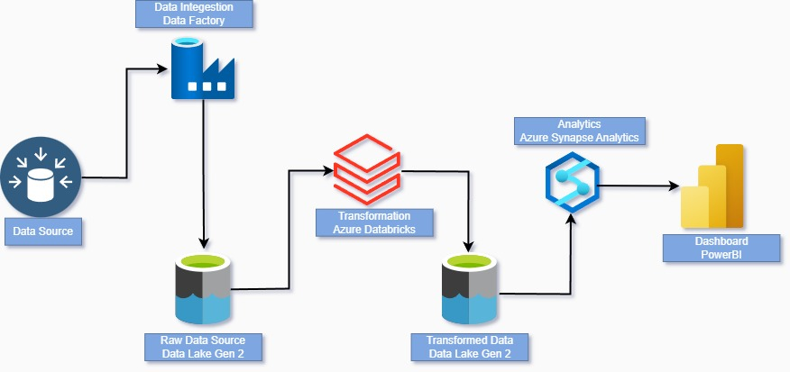
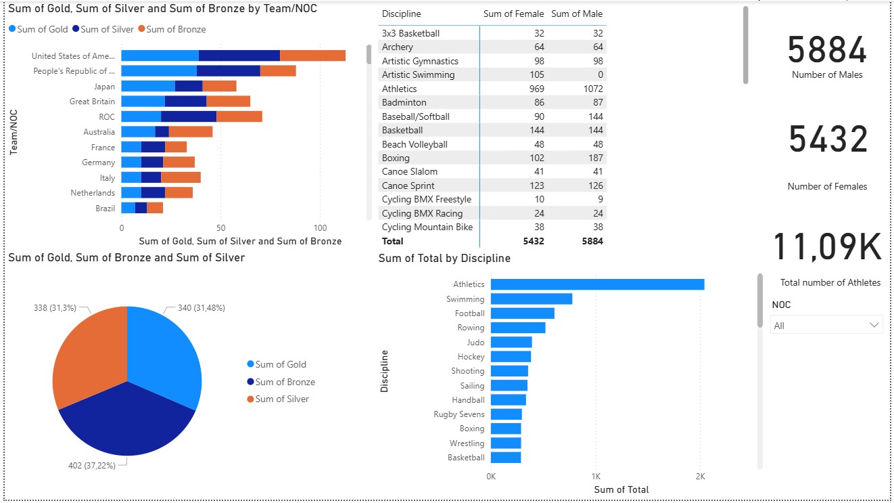

# Tokyo Olympics Data Pipeline Project 🏋️‍♂️🏋️‍♀️

This project presents a full end-to-end **data engineering and analytics solution** for the **Tokyo Olympics dataset** using **Azure Databricks**, **Azure Synapse Analytics**, **Azure Data Factory**, and **Power BI**. It demonstrates advanced data processing, transformation, orchestration, and visualization techniques in the Azure cloud ecosystem.

---

## 🌐 Architecture Overview 

---

## 📊 Key Features

- Ingested 5 key CSV datasets: `athletes.csv`, `coaches.csv`, `gender.csv`, `medals.csv`, `teams.csv`
- Data stored in **Azure Data Lake Storage Gen2 (ADLS)**
- Data copied and orchestrated with **Azure Data Factory pipelines**
- Data transformation and analysis using **Azure Databricks notebooks (PySpark)**
- Used **Spark UI** to monitor and debug jobs
- Created **interactive dashboards** in Power BI
- Visual insights such as **gender participation per discipline**, **country-wise medal tally**, etc.

---

## 📂 Dataset Details

| File           | Description                          |
|----------------|--------------------------------------|
| `athletes.csv` | Athletes and their countries/disciplines |
| `coaches.csv`  | Coaching staff by discipline          |
| `gender.csv`   | Male/Female distribution by sport     |
| `medals.csv`   | Medal winners (Gold/Silver/Bronze)    |
| `teams.csv`    | Team and delegation information       |

---

## 👩‍💼 Technologies Used

- **Azure Databricks** (ETL + ML-ready processing)
- **Azure Synapse Analytics** (Data Warehouse & SQL views)
- **Azure Data Factory** (Orchestration pipelines)
- **Azure Data Lake Gen2** (Raw and transformed storage)
- **Power BI** (Reports and dashboards)

---

## 💡 Notable Insights Generated

- Avg. Female vs Male participation in each discipline
- Countries with highest medal tallies by type
- Gender parity ratios across sports
- Visual medal distribution map and team size metrics

---

## 🌐 How to Run This Project

1. Clone the repo and upload data to your own **ADLS Gen2**
2. Deploy linked services in **Azure Synapse & Data Factory**
3. Connect Databricks to ADLS and run transformation notebooks
4. Verify transformations using Spark UI
5. Use **Power BI Desktop** or service to connect to SQL / ADLS

---

## 🏆 Final Dashboard Preview
> Real-time Olympic insights with filters by gender, team, sport, medals and region.

---

## 👤 Author
**Parbat Rajpurohit**  
Azure Data Engineer & Cloud Enthusiast

---

## 🔧 Contribution
Feel free to fork, improve or contribute visual insights, SQL scripts or improved pipelines.

---

## 🔒 License
MIT License
